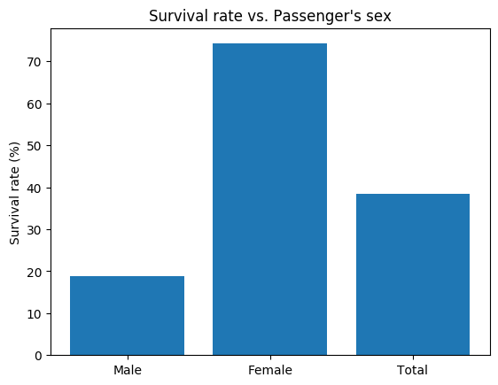

# Kagle Titanic Problem

> Implementation of a solution to the
<a href="https://www.kaggle.com/c/titanic/overview" target="_blank">**Kagle Titanic problem**</a>.
>
> Results : 78% accuracy with a random forest classifier.
>
> Inspired by the
><a href="https://www.kaggle.com/sashr07/kaggle-titanic-tutorial/notebook" target="_blank">**Kagle Tutorial**</a> and 
><a href="https://towardsdatascience.com/predicting-the-survival-of-titanic-passengers-30870ccc7e8" target="_blank">**TowardDataScience.com**</a>.

---

## Installation
- Clone this repo to your local machine using `git@github.com:FrLevesque/Titanic_Learning.git`

The code was written and tested using Python 3.6. The following libraries are required : 

- Numpy
- Pandas
- Matplotlib
- Sklearn

Once cloned, launch the program using your favorite IDE or via the command line :
```bash
$ ./Titanic.py
```

## Features
The project contains 3 main files :
- `Titanic.py` implements a solution to the problem :
  1. Loading and cleaning up the provided data (`train.csv` and `test.csv`)
  2. Testing a variety of classifiers taken from the `Sklearn` library
  3. Choosing and tuning a classifier (Random Forest) to generate predictions for Kagle
- `test_Titanic.py` contain a few unit tests.
- `Data Visualisation.py` contains functions to visualise the effect of the data features used by the classifier on the
 modeled output (ie. the survival of Titanic passengers). Their output is stored in the `Data Visualisation` folder.
 []()


## ToDo
* Improve the prediction performance of the system. Use the successful algorithms on Kagle as a starting point. Continue learning.
* Trim the number of parameters used. 
* Something could probably be done to infer the ages of the people based on their relationships, etc. 
  Same thing with the missing deck numbers based on fare price.
* Try running a simple heuristic. Would be curious to see the correlations between the features used.
* Clear out the execution warnings in `Data Visualisation`.

